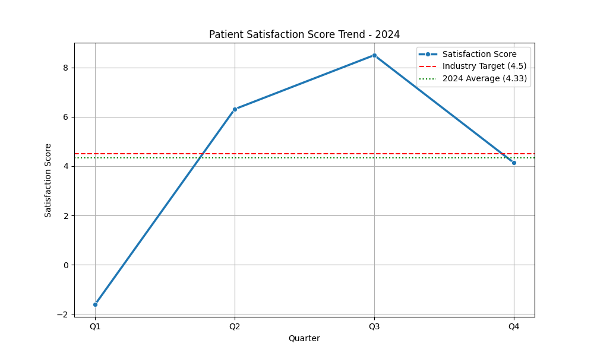

# Healthcare Performance Analysis: Improving Patient Experience

## Executive Summary
The healthcare performance analysis for 2024 reveals a fluctuating trend in patient satisfaction, with an overall average score of **4.34**. While the organization demonstrated strong recovery in Q2 and Q3, the Q1 performance was significantly below expectations, and Q4 showed a slight decline. The current average of 4.34 is just below the industry benchmark target of **4.5**. To bridge this gap, we must focus on specific areas of improvement identified in patient feedback, primarily centering on service quality and wait times.

## Data Analysis & Key Findings

### Quantitative Trend
The 2024 quarterly data shows significant volatility:
*   **Q1**: -1.61 (Major dip)
*   **Q2**: 6.31 (Strong recovery)
*   **Q3**: 8.5 (Peak performance)
*   **Q4**: 4.14 (Stabilization/Decline)

**Average Score**: 4.34



### Qualitative Insights (from Patient Feedback)
Analysis of patient reviews highlights key pain points:
*   **Wait Times**: Frequent mentions of long waiting periods for consultations, billing, and discharge processes.
*   **Service Quality**: Inconsistencies in staff behavior ("rude") and administrative efficiency ("billing", "money").
*   **Staff Interaction**: While many doctors are praised, support staff interactions (reception, security, billing) are often cited as sources of frustration.

## Business Implications
*   **Below Benchmark Performance**: Failing to meet the 4.5 target puts the organization at a competitive disadvantage.
*   **Inconsistency**: The extreme swing from -1.61 to 8.5 suggests a lack of standardized processes, leading to unpredictable patient experiences.
*   **Resource Allocation**: The feedback indicates that while medical care is often rated highly, administrative and support processes (billing, admission, discharge) are bottlenecks.

## Recommendations
To achieve the Industry Target of **4.5**, the organization should implement the following solution:

**"Improve service quality and wait times"**

Specific actions include:
1.  **Streamline Administrative Processes**: Optimize billing and discharge workflows to reduce non-clinical wait times.
2.  **Staff Training**: Conduct soft-skills training for support staff (reception, security, billing) to ensure a consistent, empathetic patient interface.
3.  **Process Standardization**: Investigate the operational differences between Q1 (low) and Q3 (high) to institutionalize the best practices that led to Q3's success.

## Data Observation
The following data was observed and analyzed:

```
Patient Satisfaction Score - 2024 Quarterly Data:
Q1: -1.61
Q2: 6.31
Q3: 8.5
Q4: 4.14
Average: 4.34
```

## Contact
For further details regarding this analysis, please contact:
**Email**: 23f2005452@ds.study.iitm.ac.in
